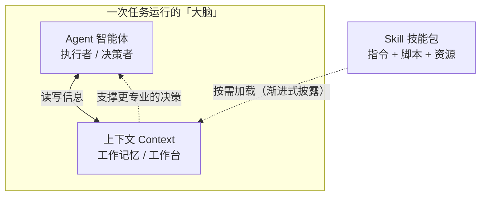

# concept-learning-skill

用 AI 构建的**个人概念学习资料生成 Skill** 仓库。

本仓库既是作业「用 AI 构建个人概念学习资料生成 Skill」的交付物，也是我后续持续积累个人知识、迭代个人 Skill 的基础工具和作品集。

## 仓库用途

- 保存一个**可复用的项目级 Skill**：`concept-learner`，用于把任意陌生概念学透、沉淀成结构化学习资料。
- 保存由该 Skill 生成、并经本人核查的**三份概念学习资料**：Agent、大模型的上下文、Skill（另有一份额外资料「向量数据库」，用于验证 Skill 的可复用性）。
- 保存一份**概念关系说明**，讲清三个概念如何协作。

## 目录结构

```
concept-learning-skill/
├── .workbuddy/
│   └── skills/
│       └── concept-learner/
│           └── SKILL.md          # 项目级 Skill（核心）
├── learning-materials/
│   ├── agent.html                # 概念 1：Agent（智能体）
│   ├── llm-context.html          # 概念 2：大模型的上下文
│   ├── skill.html                # 概念 3：Skill（技能）
│   ├── vector-database.html      # 额外资料：向量数据库（验证 Skill 可复用）
│   ├── concept-relationship.md   # 概念关系说明（含 Mermaid 图）
│   └── concept-relationship.html # 概念关系说明（网页版）
├── README.md                     # 本文件
└── .gitignore                    # 排除敏感文件
```

## 三个概念的关系（一图速览）



一句话概括：**Agent 是干活的「人」，上下文是它眼前的「工作台」，Skill 是它抽屉里「随用随取的工具手册」。**

## Skill 的存放路径与调用方式

- **存放路径**：`.workbuddy/skills/concept-learner/SKILL.md`（项目级 Skill，随仓库一起版本管理、可分享）。
- **Skill 名称**：`concept-learner`。
- **如何调用**：在 WorkBuddy 中打开本仓库后，直接告诉我「用 concept-learner 学习某个概念」，例如「用 concept-learner 学习『正则表达式』」。Skill 会按 SKILL.md 里定义的九段式流程，生成一份结构化的学习资料。
- **Skill 的能力**：接收任意新概念名称，输出「学习目标 → 核心问题 → 一句话解释 → 核心机制 → 应用场景 → 概念辨析 → 自测题 → 可核查来源 → 个人核查笔记」的学习资料，可复用、可迭代。

## 已生成的学习资料

| 概念 | 文件 | 一句话概括 |
|------|------|-----------|
| Agent（智能体） | `learning-materials/agent.html` | 能自己拿主意、自己动手做事的 AI 程序 |
| 大模型的上下文 | `learning-materials/llm-context.html` | 模型一次性能「看到」的全部内容的容量 |
| Skill（技能） | `learning-materials/skill.html` | 打包好的、按需加载的专业能力文件夹 |
| 向量数据库（额外） | `learning-materials/vector-database.html` | 按「意思相近」检索、支撑 Agent 检索能力的数据库 |
| 三者关系 | `learning-materials/concept-relationship.md`（及 `.html` 网页版） | Agent 干活、上下文是工作台、Skill 是工具手册 |

## 使用 AI 后的核查与修改记录

本仓库由 AI 协助生成初稿，我本人做了以下阅读、核查与修改：

1. **资料来源核查**：逐条点击核对了资料引用的官方来源链接（Anthropic《Building Effective Agents》《Introducing Agent Skills》、OpenAI《Managing the context window》、Pinecone 官方文档），确认均为真实可访问的官方文档，未伪造来源。
2. **内容理解与改写**：阅读了 AI 生成的初稿，把部分偏术语化的表述改写成更通俗易懂的白话和类比，确保我能用自己的话讲出来。
3. **结构完善**：对照作业要求，为 Skill 补充了「学习目标」「核心问题」两个要素，使学习资料组织更完整（由七段式完善为九段式）。
4. **自测题自检**：逐题核对了自测题的答案是否准确。
5. **敏感信息检查**：确认仓库中不含任何 API Key、密码、token、个人隐私信息（`.gitignore` 已排除此类文件）。

> 每份资料的最后一节「我的理解与核查笔记」由我本人补充，体现个人的理解和判断。

## 版本与安全

- 全部内容已提交到本地 Git 仓库并 push 到 GitHub，仓库为**公开访问**，教师无需申请权限即可查看。
- 本仓库**不包含**任何 API Key、密码、个人隐私信息或其他敏感文件；`.gitignore` 已排除常见敏感文件类型。

## 踩坑与解决记录

在搭建环境和完成本作业的过程中，我遇到并解决了以下问题（记录问题与最终解决方式）：

1. **GitHub SSH 端口（22/443）被网络屏蔽** → 无法用 SSH 认证推送，最终改用 **HTTPS + Personal Access Token（PAT）** 完成认证与推送。
2. **`git push` 时 `github.com` 不可达**（走代理返回 502、直连失败，但 `api.github.com` 正常）→ 临时改用 **GitHub Contents API** 把文件内容写进仓库，效果等同于 push。
3. **本地与云端提交历史分叉**（因上述 API 推送导致）→ 网络恢复后用 `git pull --rebase origin main` 对齐，本地与云端重新一致。
4. **`osxkeychain` 凭据存储在自动化环境不可用** → 改用 `store` 方式，凭据保存在 `~/.git-credentials`（权限 600）。

## 后续迭代

后续课程项目可在此仓库基础上继续：用 `concept-learner` 学习新概念、新增 `learning-materials/` 下的资料、或新增其他个人 Skill。
