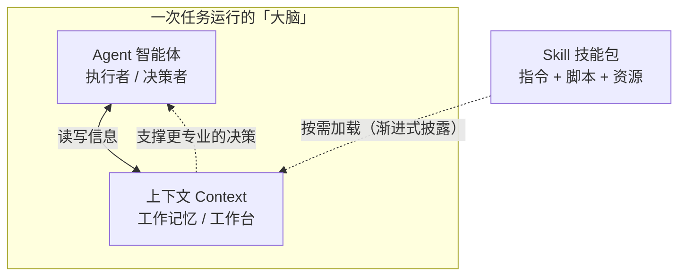

# concept-learning-skill

用 AI 构建的**个人概念学习资料生成 Skill** 仓库。

本仓库既是作业「用 AI 构建个人概念学习资料生成 Skill」的交付物，也是我后续持续积累个人知识、迭代个人 Skill 的基础工具和作品集。

## 仓库用途

- 保存一个**可复用的项目级 Skill**：`concept-learner`，用于把任意陌生概念学透、沉淀成结构化学习资料。
- 保存由该 Skill 生成、并经本人核查的**概念学习资料**：**6 份**——Agent、大模型的上下文、Skill、向量数据库（用于验证 Skill 的可复用性）、概念关系说明（体裁为关系梳理）、LLM Wiki。
- 保存一条**传播学线的学习产出**：普莫时代（PUMO）资料、李普曼学习页面、《传播学经典理论》学习导读。
- 保存一套 **LLM Wiki 个人知识库**（`raw/` / `wiki/` / `graph/` / `tools/` 四层结构）：把学过的概念编译成互相双链的页面，并画出知识图谱。

## 目录结构

```
concept-learning-skill/
├── .workbuddy/
│   └── skills/
│       └── concept-learner/
│           └── SKILL.md            # 项目级 Skill（作业核心交付物）
├── AGENTS.md                       # LLM Wiki 的规范文件（schema 与工作流）
├── raw/                            # 不可变的事实来源层（只读，只新增）
├── wiki/                           # AI 维护的内容层
│   ├── index.md                    #   所有页面的总目录
│   ├── log.md                      #   只追加的操作日志
│   ├── overview.md                 #   跨来源的"活的"综述
│   ├── sources/                    #   每份原始资料一页摘要
│   ├── entities/                   #   人物、公司、项目、产品
│   ├── concepts/                   #   概念、框架、方法、理论
│   └── syntheses/                  #   回答过的提问，回填成页面
├── graph/                          # 知识图谱产物
│   ├── graph.json                  #   节点 / 边数据
│   └── graph.html                  #   浏览器打开即可交互的可视化
├── tools/                          # 零依赖的 Python 脚本
│   ├── health.py                   #   结构体检（零 LLM 调用）
│   ├── lint.py                     #   内容体检（确定性部分）
│   ├── build_graph.py              #   生成知识图谱
│   └── wiki_lib.py                 #   三个脚本共用的解析库
├── learning-materials/             # 作品输出区：学习页面与概念关系说明
│   ├── agent.html                  #   概念 1：Agent（智能体）
│   ├── llm-context.html            #   概念 2：大模型的上下文
│   ├── skill.html                  #   概念 3：Skill（技能）
│   ├── vector-database.html        #   概念 4：向量数据库（验证 Skill 可复用）
│   ├── concept-relationship.md     #   概念 5：概念关系说明（含 Mermaid 图）
│   ├── concept-relationship.html   #   概念 5 的网页版
│   ├── llm-wiki.html               #   概念 6：LLM Wiki
│   ├── pumo.html                   #   传播学线：普莫时代（PUMO）
│   ├── lippmann.html               #   传播学线：学习页面（李普曼）
│   └── communication-classics-guide.html  # 传播学线：《传播学经典理论》导读
├── README.md                       # 本文件
└── .gitignore                      # 排除敏感文件
```

> 各目录职责的详细说明见下文《LLM Wiki 个人知识库》一节。

## 三个概念的关系（一图速览）



一句话概括：**Agent 是干活的「人」，上下文是它眼前的「工作台」，Skill 是它抽屉里「随用随取的工具手册」。**

## Skill 的存放路径与调用方式

- **存放路径**：`.workbuddy/skills/concept-learner/SKILL.md`（项目级 Skill，随仓库一起版本管理、可分享）。
- **Skill 名称**：`concept-learner`。
- **如何调用**：在 WorkBuddy 中打开本仓库后，直接告诉我「用 concept-learner 学习某个概念」，例如「用 concept-learner 学习『正则表达式』」。Skill 会按 SKILL.md 里定义的九段式流程，生成一份结构化的学习资料。
- **Skill 的能力**：接收任意新概念名称，输出「学习目标 → 核心问题 → 一句话解释 → 核心机制 → 应用场景 → 概念辨析 → 自测题 → 可核查来源 → 个人核查笔记」的学习资料，可复用、可迭代。

## 已生成的学习资料

**AI 概念线 —— `concept-learner` 的 6 份产出**

| # | 概念 | 文件 | 一句话概括 |
|---|------|------|-----------|
| 1 | Agent（智能体） | `learning-materials/agent.html` | 能自己拿主意、自己动手做事的 AI 程序 |
| 2 | 大模型的上下文 | `learning-materials/llm-context.html` | 模型一次性能「看到」的全部内容的容量 |
| 3 | Skill（技能） | `learning-materials/skill.html` | 打包好的、按需加载的专业能力文件夹 |
| 4 | 向量数据库 | `learning-materials/vector-database.html` | 按「意思相近」检索、支撑 Agent 检索能力的数据库（用来验证 Skill 可复用） |
| 5 | 概念关系说明 | `learning-materials/concept-relationship.md`（及 `.html` 网页版） | Agent 干活、上下文是工作台、Skill 是工具手册 |
| 6 | LLM Wiki | `learning-materials/llm-wiki.html` | 先「编译」成页面、再查询的个人知识库模式 |

**传播学线 —— 本仓库额外的学习产出**

| 主题 | 文件 | 一句话概括 |
|------|------|-----------|
| 普莫时代（PUMO） | `learning-materials/pumo.html` | 2025 年提出的时代环境框架：极化、难以想象、质变、过热 |
| ：李普曼 | `learning-materials/lippmann.html` | 拟态环境与刻板成见——我们活在媒介转述的世界里 |
| 《传播学经典理论》导读 | `learning-materials/communication-classics-guide.html` | 六大板块 × 14 个核心概念 + 六周学习路线 |

## 使用 AI 后的核查与修改记录

本仓库由 AI 协助生成初稿，我本人做了以下阅读、核查与修改：

1. **资料来源核查**：逐条点击核对了资料引用的官方来源链接（Anthropic《Building Effective Agents》《Introducing Agent Skills》、OpenAI《Managing the context window》、Pinecone 官方文档），确认均为真实可访问的官方文档，未伪造来源。
2. **内容理解与改写**：阅读了 AI 生成的初稿，把部分偏术语化的表述改写成更通俗易懂的白话和类比，确保我能用自己的话讲出来。
3. **结构完善**：对照作业要求，为 Skill 补充了「学习目标」「核心问题」两个要素，使学习资料组织更完整（由七段式完善为九段式）。
4. **自测题自检**：逐题核对了自测题的答案是否准确。
5. **敏感信息检查**：确认仓库中不含任何 API Key、密码、token、个人隐私信息（`.gitignore` 已排除此类文件）。

> 每份资料的最后一节「我的理解与核查笔记」由我本人补充，体现个人的理解和判断。

## 版本与安全

- 全部内容已通过本地 Git 提交（`git commit`）并 `git push` 上传到 GitHub，仓库为**公开访问**，教师无需申请权限即可查看。
- 本仓库**不包含**任何 API Key、密码、个人隐私信息或其他敏感文件；`.gitignore` 已排除常见敏感文件类型。

## 踩坑与解决记录

在搭建环境和完成本作业的过程中，我遇到并解决了以下问题（记录问题与最终解决方式）：

1. **GitHub SSH 端口（22/443）被网络屏蔽** → 无法用 SSH 认证推送，最终改用 **HTTPS + Personal Access Token（PAT）** 完成认证与推送。
2. **`git push` 时 `github.com` 短暂不可达**（走代理返回 502、直连失败，但 `api.github.com` 正常）→ 曾临时用 GitHub Contents API 写入文件以完成同步；网络恢复后已改用标准 `git push` 完成最终上传。
3. **本地与云端提交历史分叉**（因临时 API 写入导致）→ 网络恢复后先对齐本地与云端基线，再通过标准 `git commit` + `git push` 完成上传，最终本地与云端提交历史完全一致、均为标准 push 结果。
4. **`osxkeychain` 凭据存储在自动化环境不可用** → 改用 `store` 方式，凭据保存在 `~/.git-credentials`（权限 600）。

## LLM Wiki 个人知识库

除作业交付的 `concept-learner` Skill 之外，我在本仓库里另外接入了一套 **LLM Wiki** 个人知识库（思路由 Andrej Karpathy 提出，规范参照开源实现 `SamurAIGPT/llm-wiki-agent`）。它解决的是一个很具体的问题：**学过的东西会忘，而且学过的概念之间连不起来。**

### 1. 我为什么要接入 LLM Wiki

- **对话式学习留不下东西。** 一次对话的上下文是临时的，新开对话不会自动带上上次的内容；课上学到的结论散在各次对话里，事后找不回来。把它们**固化成仓库里的文件**，才是能长期保存、能回看、能版本管理的"记忆"。
- **知识不该是一堆孤立的资料。** 用 `concept-learner` 一次只产出一份 HTML 资料，概念之间是散的。LLM Wiki 把资料**编译**成互相双链的页面，再用知识图谱把关系画出来，概念才真正连成体系。
- **"编译一次"比"每次重新检索"划算。** 原始资料读一遍就固化成 wiki 页面，之后提问直接查页面，不用反复重读原文。
- **产出要我自己读得懂。** 我要的是能读懂的白话页面 + 一张关系图，而不是一堆散落的 HTML 文件。

> 说明：本仓库是**公开**仓库，所以这套 wiki 的内容也是公开的。它记的是学习笔记与工程实践，不含任何凭据或隐私信息。

### 2. 目录结构：四层各管什么

| 目录 | 作用 | 谁维护 |
|---|---|---|
| `raw/` | **不可变的原始资料层**，也是唯一的事实来源。要学的东西丢这里 | 我只**新增**，永不修改、删除、重命名 |
| `wiki/` | **内容层**——AI 读完 `raw/` 后写出的互相链接的页面 | AI 维护，我不手工改 |
| `graph/` | **知识图谱产物**：`graph.json`（节点/边数据）与 `graph.html`（浏览器打开即可交互） | 脚本生成 |
| `tools/` | **零依赖的 Python 脚本**：`health.py` / `lint.py` / `build_graph.py` | 脚本 |

`wiki/` 内部再分四类内容，外加三个固定页面：

```
wiki/
├── index.md      # 所有页面的总目录，每次 ingest 后更新
├── log.md        # 只追加的操作日志
├── overview.md   # 跨所有来源的"活的"综述
├── sources/      # 每份原始资料一页摘要（kebab-case.md）
├── entities/     # 人物、公司、项目、产品（TitleCase.md）
├── concepts/     # 概念、框架、方法、理论（TitleCase.md）
└── syntheses/    # 回答过的提问，回填成页面（kebab-case.md）
```

根目录另有一份 `AGENTS.md`，写的是这套 wiki 的**规范**：frontmatter 必填字段、命名约定、四类工作流、以及几条"铁律"（`raw/` 只读、`wiki/` 由 AI 维护、不伪造来源等）。

**当前规模**（2026-09-14）：**69 个页面** —— 12 个 source、7 个 entity、41 个 concept、4 个 synthesis，另加 5 个元页面（`index` / `log` / `overview` 与两份体检报告）；知识图谱 **69 节点 / 592 条边**（436 条确定性抽取 + 156 条语义推断）/ **8 个社区**。

### 3. 怎么调用：五个触发词

**前提**：要在 WorkBuddy 里把工作目录指到本仓库文件夹（这样 `AGENTS.md` 的规范和项目记忆才会加载），然后**直接用自然语言说触发词**即可，不需要自己敲命令：

| 我说 | AI 做什么 |
|---|---|
| `ingest raw/xxx.md` | 读原始资料 → 写 `wiki/sources/` 摘要页 → 更新 `index.md` 与 `overview.md` → 建/更新 entity 与 concept 页 → 记 `log.md` |
| `query: 主要讲了什么？` | 读 index 找相关页 → 带 `[[双链]]` 引用作答 → 问我要不要存成 `syntheses/` 页 |
| `health` | 跑 `python3 tools/health.py`：结构体检（空页、目录同步、日志覆盖），**零 LLM 调用、不花 token** |
| `lint` | 内容体检：断链、孤儿页、跨页矛盾、摘要过时、缺页候选、数据缺口 |
| `build graph` | 跑 `python3 tools/build_graph.py`，重新生成 `graph.json` + `graph.html` |

我在这个项目里实际用过的说法（都是原话）：

- 「请用 LLM Wiki 的方式，摄取 `raw/agent.html` 这一份资料」
- 「请对我的知识库做一次 health 检查，列出所有结构问题，然后直接把它们修好」
- 「health 通过了，现在做一次 lint 内容检查：找孤立页、断链、内容互相矛盾的地方、摘要过时的页面」

脚本也可以自己跑（需要 Python 3，无第三方依赖）：`python3 tools/health.py`、`python3 tools/lint.py`、`python3 tools/build_graph.py`；加 `--save` 会把报告写回 `wiki/` 下的 `health-report.md` / `lint-report.md`。

### 4. 我做了哪些人工核查与修改

先记一条关键认识：**`health` / `lint` 报"全绿"不等于没问题**。脚本只做确定性检查，它自己在报告结尾就声明「矛盾 / 过时声明 / 缺失交叉引用 / 数据空白」这四项**没查**，需人工读。下面是我实际查出来并修掉的问题。

**（1）`.gitignore` 的 `token*` 通配把 wiki 页面悄悄忽略了**

- **现象**：提交前核对文件清单，发现 `wiki/concepts/Token.md` **既不在已追踪列表、也不在未跟踪列表里**——两个列表都查不到，只可能是被忽略了。
- **根因**：`.gitignore` 里为防凭据泄露写了 `token*`（不限扩展名的通配）。macOS 文件系统**大小写不敏感**，于是它命中了 `wiki/concepts/Token.md`。
- **危害**：该页面在磁盘上完好、两个体检脚本全绿，**但 git 完全不看它**——不报错、不提示，提交时也不会带上，而且极难发现。
- **修法**：在所有排除规则**之后**加内容层兜底 `!wiki/**` 与 `!raw/**`（例外必须写在最后）。用 `git status --porcelain --ignored`、`git check-ignore -v`、`git status --porcelain` 三连验证；同时确认真正的凭据文件（根目录 `token.json`）依旧被忽略，安全规则没有被削弱。
- **结论**：判断一条忽略规则危不危险，看它**有没有限定扩展名**。`*.log` 是安全的；`token*` / `secrets*` / `credentials*` 属高危。

**（2）`wiki/sources/vector-database.md` 被外部程序改写损坏**

- **现象**：六个 frontmatter 字段全部丢失、只剩一行 `title`，YAML 引号被去掉，正文顶部的 HTML 注释被删，行尾被补了两个空格——典型的 **Markdown 格式化器**手法，本仓库脚本不可能产生（`tools/` 里只有 4 处 `write_text`，只写报告与图谱，不碰页面）。
- **排查**：**mtime 是决定性证据**——`lint-report.md` 写于 `01:06:43`，而该页面改于 `01:06:44`，也就是"体检报 0 违规"**之后**才被改坏，属时序巧合而非脚本失效。随后重跑 `lint.py`，它能正确报出 4 条「缺少字段」。又做复现测试：恢复文件后重跑两个脚本，mtime 未变、`git status` 为空 → **脚本清白**。
- **修复**：先 `cp` 损坏现场留证，再 `git checkout HEAD -- <路径>`（HEAD 里是完好版本）；修复后工作区即与远端一致，**无需重新提交**。
- **推测诱因**：把这份页面推送预览时触发了「渲染 + 规范化保存」。教训是：**不要假设"自己写进磁盘的内容还在"**——改完页面、提交之前，用 `git status` + `lint.py` 复核一遍。

**（3）知识图谱产物不可复现**

- **现象**：`build_graph.py` 生成的时间戳 `built_at` 精确到分钟，导致**内容一字未改的重复构建**也产生 git 差异，把工作区弄脏，让"这次到底有没有真改动"难以判断。
- **修法**：时间戳精度改为 `%Y-%m-%d`。验证：跨分钟连续构建两次，`graph.json` / `graph.html` 的 md5 完全一致。

**（4）语义层 lint：脚本全绿，但人工通读 37 页后读出 9 项问题，已逐条整改（涉及 22 个文件）**

1. **`log.md` 漏记三类操作**：`lint` 从未入账（可 `lint-report.md` 已被生成过两次）、`graph` 只记了"首次构建"（实际重建两次）、`health` 复检未记。→ 补齐 3 条记录。
2. **`ToolUse` 近乎孤立**：只有 1 条入链，而 `Workflow` / `Memory` / `ContextManagement` / `LLMWiki` 正文都提到"工具"却没链它。→ 在这 4 页各补一条带说明的双链，**入链 1 → 5**。
3. **综合页没人引用**：`agent-context-skill-relationship` 只有 1 条入链——它专门论述的三个主角页 `Agent` / `Context` / `Skill` 反倒都没链它。→ 三页各补一条，**入链 1 → 4**。
4. **`index.md` 来源标注漏 2 处**：`vector-database` 与 `concept-relationship` 同样已迁到 `raw/`，却没打标注。→ 补上。
5. **`overview.md` 修订记录漏最后一步**（来源迁移收尾）。→ 补第 6 条。
6. **MCP 命中了"缺页判据"却没被脚本报出**：被 3 个页面提到、0 个页面，而 `lint.py` 报"缺页候选 0"。→ 在 overview 的空白清单里加注说明，明确「缺页候选 0 ≠ 没有缺口」；因材料不足**没有建页**，避免造一个空骨架。
7. **资料有内容没编译进 wiki**（"什么时候不该建自动化"三条、"三个反直觉点"）。→ 补进 `Automation` 与 class2 source 页。
8. **章节名两套写法**（「待补」7 处 vs「待补充」7 处）。→ 统一为「待补充」。
9. **`AGENTS.md` 与实际结构脱节**（目录布局没列两份体检报告页、没说脚本生成物不入 index 五段、没写脚本盲区）。→ 补齐。

另处理了一处**用词张力**：class2 页说本仓库是"四层结构"，而模式本体其实是三层（`raw` / `wiki` / schema），`graph` 与 `tools` 属实现层扩展。→ 给那句补了限定语，并指向 `LLMWiki.md` 的"本站的落地差异"。

整改后校验：三个脚本退出码全 0；内容页里"入链 ≤ 1"的页面**归零**；章节名残留 0；图谱由 234 边变为 236 边（属内容改动的预期差异）。**未发现真正的事实性互斥矛盾**——没有任何两个页面对同一字段给出不同取值。

**（5）脚本之外固定要人工过的 7 项**（已写进 `AGENTS.md`，因为都是脚本查不到的）

1. `raw/` 与 source 页双向对应（有无未被引用的资料、有无 `source_file` 指向不存在的文件）
2. **双链大小写**——macOS 不敏感、GitHub 敏感，本地看着正常，推上去链接会断
3. markdown 链接 `[文字](路径)`（脚本只查 `[[双链]]`，不查这种）
4. 命名规范（concept / entity 用 TitleCase，source / synthesis 用 kebab-case）
5. `log.md` 里引用的文件是否真实存在
6. `type` 字段与所在目录是否匹配（lint 只查取值合法，不查是否与目录一致）
7. 目录是否留空、最短页面是否属残页

### 5. 每日自动维护任务

我在 WorkBuddy 里配置了一个**每天 23:19** 执行的定时任务「知识库每日维护与概念征询」，让它自己把这件事持续做下去（这是本地应用的一项设置，**不在仓库代码里**）。它做五件事：

1. 跑 `tools/health.py` 与 `tools/lint.py` 做体检，有问题先修好再往下走；顺手比对 `log.md` 的操作序列与 git 记录，补上漏记的操作
2. 检查 `raw/` 里还没被摄取的新资料并 ingest（**没有新资料就如实说明，不硬造内容**）
3. 提出新概念候选**征询我的意见**——只提不建；我点头的才进私有候选清单，够材料了才建页
4. 写一份当日简报：新增/更新了哪些页面、概念之间**新建了哪些联系**、发现了什么知识缺口、下一步建议
5. 若有变更，按语义分箱提交并推送到 GitHub（如 `wiki/` 内容层、`raw/` 来源层、`tools/` + `graph/` 分开提交，不用一坨 `update`）

**简报写在哪里（重要）**：`.workbuddy/memory/daily/YYYY-MM-DD.md`——**不是** `wiki/` 下。`wiki/` 是公开层，而简报含个人学习状态、疑问与候选清单，**只留在本机的私有目录**（`.workbuddy/memory/` 已被 `.gitignore` 整目录忽略）。

简报里固定报一个数：**当前 concept 页总数 + 距"本学期沉淀 50 个以上概念"还差几个**（截至 2026-09-14 为 **41 个，还差 9 个**）。

> 注意：这类定时任务需要**电脑开机且 WorkBuddy 在运行**才会触发。

## 后续迭代

后续课程项目可在此仓库基础上继续：用 `concept-learner` 学习新概念、新增 `learning-materials/` 下的资料、或新增其他个人 Skill。
