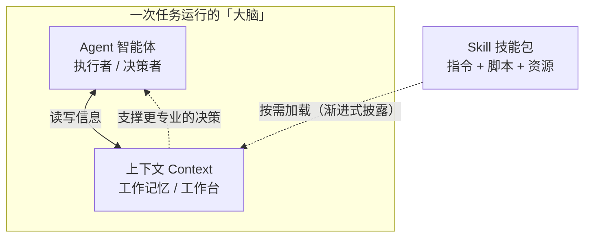

# 概念关系说明：Agent、上下文、Skill 三者之间的关系

本文用文字、表格与 Mermaid 图，说明三个概念如何协作。这是本人对三个概念关系的理解。

## 一、三个概念各自的「定位」

| 概念 | 一句话定位 | 扮演的角色 |
|------|-----------|-----------|
| Agent | 能自己拿主意、自己动手做事的 AI 程序 | 执行者 / 决策者 |
| 上下文 | 模型一次性能「看到」的全部内容的容量 | 工作记忆 / 工作台 |
| Skill | 打包好的、按需加载的专业能力文件夹 | 可复用的知识包 |

## 二、一张图看懂三者的关系

这张图说明了一个**闭环**：**Skill** 在需要时把专业知识「装进」**上下文**，**上下文** 把「装了什么」提供给 **Agent** 做决策，**Agent** 据此更专业地行动。三者缺一不可。

## 三、重点关系 ①：上下文如何影响 Agent 的工作

**上下文是 Agent 决策的「原料」。** Agent 运行时能看到的一切——用户目标、对话历史、工具结果、加载进来的 Skill 内容——全都堆在上下文窗口里。所以：

- **上下文大小 = Agent 的「眼界」**：窗口越大，Agent 一次能记住和参考的信息越多，做复杂决策越不容易「忘事」。
- **上下文内容 = Agent 的「判断质量」**：喂给 Agent 的信息不相关或太冗长，会挤占窗口，反而让 Agent「看不清重点」、做出更差的决定。
- **窗口满时会「遗忘」**：超出上限后最早的信息被挤掉，Agent 就像「忘了前面聊过什么」，这是长任务里 Agent 表现下滑的常见原因。

> 一句话：上下文决定了 Agent 能「看到多少、看清多少」，因此也决定了它「想得对不对、做得好不好」。

## 四、重点关系 ②：Skill 如何沉淀可复用的任务知识

**Skill 把「一次性经验」变成「可反复调用的方法」。** 它通过「渐进式披露」，只在任务需要时把专业知识注入上下文，从而：

- **沉淀**：把「怎么做某件事」的流程、指令、工具固化成文件夹（SKILL.md + 资源），不会用完就丢。
- **省空间**：平时只预读 name+description，需要时才加载全文，不浪费宝贵的上下文。
- **可复用**：同一个 Skill 能用于多个相似任务（比如 concept-learner 能学任何新概念），也能分享给他人、持续迭代。

> 一句话：Skill 让「通用 Agent」在需要时临时变成「专业 Agent」，而不用每次都从头教一遍。

## 五、串起来的一句话（我的理解）

**Agent 是干活的「人」，上下文是它眼前的「工作台」，Skill 是它抽屉里「随用随取的工具手册」。** 三者协作：合适的 Skill 按需把专业方法摆上工作台，让 Agent 在有限的上下文里做出更专业的判断和行动。
